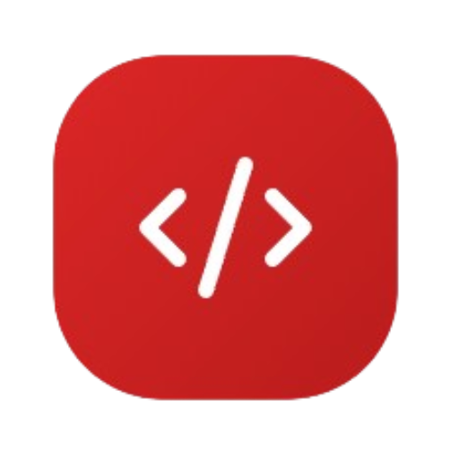

<div align="center">
  

  # Dev Showcase

  **Um repositório para guardar, testar e mostrar tudo que aprendi como desenvolvedor de software.**

  <p>
    <a href="https://nextjs.org"></a>
    <a href="https://react.dev"></a>
    <a href="https://www.typescriptlang.org"></a>
    <a href="https://tailwindcss.com"></a>
    <a href="https://playwright.dev"></a>
  </p>
  <p>
    
    
    
    
    
    
  </p>
</div>

---

## O que é este repositório

Cinco anos escrevendo software deixam para trás muito mais conhecimento do que cabe na memória ou que conseguimos colocar em um currículo. Este repositório existe para resolver os dois lados desse problema ao mesmo tempo:

1. **Registrar meu próprio progresso** — um lugar para guardar o que aprendi, para eu mesmo revisitar daqui a um ano e lembrar como e por que resolvi algo de um jeito específico.
2. **Ambiente seguro de experimentação** — um espaço onde posso testar uma API nova, arquitetura diferente ou prática que só conhecia de ouvir falar, sem o risco de fazer isso pela primeira vez dentro de um sistema em produção de verdade. Isso me dá a liberdade, espaço e infraestrutura que eu precisava para deixar a criatividade fluir.

Como consequência natural dos dois pontos acima, acredito que também posso usar este espaço como **portfólio**: cada demo aqui é código real, funcionando, que qualquer desenvolvedor ou recrutador técnico pode abrir, usar e avaliar por conta própria. O foco das demos não é ser um guia de implementação, mas sim uma explicação de como algum conceito funciona e como isso pode ser feito na prática.

Cada rota da aplicação é uma **demonstração isolada e funcional** de uma funcionalidade, exemplo: autenticação, PWA, 3D, captura de mídia, sensores de hardware, e assim por diante. Tomei o cuidado, em cada demonstração, de aplicar o mesmo mínimo de acessibilidade, i18n (tradução), testes e tratamento de erro que eu aplicaria em um produto real.

### Por que talvez você encontre menos do que cinco anos de trabalho aqui

Documentar tudo retroativamente é impossível de fazer em poucos meses. Eu objetivamente quero criar algo importante aqui, e fazer isso "correndo" não é do meu estilo. Por enquanto priorizei documentar o que tenho mexido mais recentemente. O plano é ir enchendo os buracos aos poucos: revisitar projetos e decisões mais antigas e trazê-las para cá conforme o tempo permite, sem pressa e sem sacrificar qualidade pelo volume.

Cada demo é pesquisada, escrita e publicada por mim, com o objetivo de explicar as coisas de um jeito simples o bastante para uma pessoa leiga acompanhar o raciocínio, mas completo o bastante para que outro desenvolvedor reconheça a profundidade técnica por trás. Quero que este projeto também sirva para gente sem nenhum background técnico. Se você é desenvolvedor, provavelmente já tentou explicar para alguém da família o que exatamente você faz — e sabe como é frustrante não conseguir. Eu já passei por isso algumas vezes, e gostaria de poder entregar este projeto na mão dos meus pais, irmãos e tios e dizer: "mexe aqui, olha quantos jeitos diferentes existem de se autenticar em um site", ou "olha como é bonito interagir com 3D", ou "o site inteiro continua funcionando mesmo sem internet, por causa do PWA". Sei que abraçar o mundo inteiro é impossível — meus avós provavelmente ainda não vão entender tudo isso — mas a linguagem aqui é simples, direta e objetiva de propósito.

---

## O catálogo

A página inicial lista cada entrada do registry como um card clicável. Hoje são **9 demos funcionando de ponta a ponta** e **7 já reservadas no catálogo** (metadata completa, aguardando implementação) — o contador exato é calculado ao vivo a partir do código, não é um número fixo neste texto.

### Live

| Demo | Categoria | O que ela demonstra |
|---|---|---|
| **Autenticação** | Segurança | Cinco métodos de login lado a lado: JWT, OAuth 2.0, TOTP, Magic Link e WebAuthn/Passkeys |
| **PWA Install & Cache Engine** | PWA | Manifest, Service Worker e estratégias de cache via Serwist, instalação como app |
| **3D & Animações Avançadas** | UX | Cenas interativas com React Three Fiber/Three.js — órbita de câmera, sistema solar, shader de galáxia em GLSL |
| **Media Capture Studio** | Mídia | Gravação de vídeo, tela e áudio via `MediaRecorder`, com player customizado e acessível |
| **Web Push Notifications** | Comunicação | Ciclo completo de push: permissão, subscription, envio real via VAPID |
| **Voice Interface** | Acessibilidade / IA | Reconhecimento de fala e text-to-speech nativos do navegador |
| **Offline Data Layer** | Arquitetura | SQLite via WebAssembly rodando dentro de um Web Worker (OPFS + wa-sqlite), IndexedDB e Background Sync |
| **Integrações Nativas do Navegador** | UX Nativa | Web Share, Clipboard, Screen Wake Lock, Storage API, Full Screen API |
| **Sensores e Hardware do Dispositivo** | Hardware | Network Information, Battery Status, Vibration API |

### Reservadas no catálogo (metadata pronta, sem demo funcional ainda)

`Dashboards` · `Real-time & Comunicação` · `Arquitetura de Micro-frontends` · `React Query Mastery` · `Performance Showcase` · `Formulários & Campos` · `GraphQL`

Uma entrada "em breve" tem card visível e página própria (nome, descrição, tecnologias, arquitetura pretendida) — mas sem lógica interativa. É assim de propósito: sinaliza continuidade e me ajuda também a focar nessas demos como sendo as próximas a terem prioridade para lançamento.

---

## Stack

| Camada | Tecnologia |
|---|---|
| Framework | Next.js 16 (App Router + Route Handlers) |
| Linguagem | TypeScript |
| UI | React 19, Tailwind CSS v4 |
| 3D | React Three Fiber + Three.js |
| Animação | Motion (`motion/react`) |
| Data fetching | TanStack React Query |
| i18n | next-intl — pt-BR / en-US / es-ES |
| Auth / dados | Supabase (`@supabase/ssr`), NextAuth, JWT (`jsonwebtoken`), TOTP (`otplib`) |
| PWA | Serwist (Service Worker) |
| Offline / storage | wa-sqlite (SQLite via WASM), IndexedDB, OPFS |
| Push | web-push (VAPID) |
| Validação | Zod |
| Testes | Playwright (E2E, único test runner do projeto) |
| Cobertura | `monocart-coverage-reports` via CDP/V8 |
| Qualidade estática | SonarQube (self-hosted via Docker) |

---

## Arquitetura e conceitos aplicados

### Feature-Sliced Design

Esta é a decisão arquitetural central do projeto. Cada capacidade demonstrada vive isolada em `src/features/<nome>/`, com uma fatia própria de `assets/`, `components/`, `hooks/`, `i18n/`, `pages/`, `services/` e `tests/`. Nada de uma pasta `components/` global compartilhada por tudo — cada feature é autocontida e pode ser lida, testada e removida sem tocar nas outras.

O contrato entre uma feature e o resto do site é um único arquivo: `services/metadata.ts`, tipado por `DemoMetadata` (`src/registry/types.tsx`), registrado em `src/registry/index.ts`. **Uma entrada no registry é, literalmente, um card na Home** — essa regra simples é o que faz o catálogo crescer sem virar caos: para adicionar uma demo nova, a mecânica é sempre a mesma, não importa quão complexa seja a demo por trás.

```
src/
├── app/                          → Next.js App Router (páginas, Route Handlers, error/not-found boundaries)
├── registry/
│   ├── index.ts                  → Lista de funcionalidades — uma entrada = um card na Home
│   └── types.tsx                 → Contrato DemoMetadata / DemoEntry
├── features/
│   ├── shared/                   → Navbar, Footer, CategoryFilter, DemoCard, providers, hooks compartilhados
│   ├── about/                    → Página "Sobre" (trajetória, skills, contato, download de CV)
│   └── <nome-da-feature>/
│       ├── assets/
│       ├── components/
│       ├── hooks/
│       ├── i18n/                 → pt-BR.json / en-US.json / es-ES.json
│       ├── pages/                → Demo.tsx — componente de entrada
│       ├── services/
│       │   ├── metadata.ts       → DemoMetadata desta feature
│       │   └── api.ts            → quando a feature fala com uma API route
│       └── tests/                → specs Playwright (E2E) desta feature
└── testing/                       → configuração de cobertura
```

### Outras decisões que valem a pena registrar

- **Renderização por rota, não por convenção fixa** — Server Components e conteúdo estático por padrão (Home, Sobre, metadata de rota); `"use client"` é reservado para interatividade real (canvas, formulário, qualquer Browser API). A maioria das demos aqui é CSR de propósito: é exatamente aí que a interação com hardware/API do navegador acontece.
- **Detecção de suporte a Browser API sem quebrar hidratação** — todo `typeof navigator/window !== "undefined"` nasce como estado otimista (`useState(true)`) corrigido via `useEffect`, nunca como `const` calculada direto no corpo do componente. Isso evita divergência entre o HTML gerado no servidor e o primeiro render no cliente.
- **Degradação explícita, nunca tela branca** — `error.tsx`/`global-error.tsx`/`not-found.tsx` cobrem qualquer exceção não tratada com uma tela específica, e cada demo que depende de uma Browser API sem suporte universal (Battery Status, Background Sync, Fullscreen em iOS Safari) mostra uma mensagem de degradação específica em vez de estourar erro.
- **i18n** — todas as 9 features live + Home + Sobre têm `i18nNamespace` e as três traduções completas, chave a chave.
- **Acessibilidade** — WCAG 2.1/2.2 AA aplicado nas rotas: navegação por teclado, `aria-label` em botão só-ícone, alvo de toque mínimo de 24×24px, foco preso em modal, hierarquia de heading sem pular nível.

---

## Qualidade e métricas

Este projeto - por enquanto - não tem CI configurado. Isso não significa medir menos: cobertura e análise estática rodam localmente, e o resultado é versionado. Em breve pretendo configurar CI/CD com o mesmo Gitflow que uso nos projetos internos em que trabalho.

- **Testes** — Playwright é o único test runner. Toda a suíte roda contra build de produção (`next build && next start`), 3 engines (Chromium, Firefox, WebKit).
- **Cobertura** — coletada via CDP/V8 (`monocart-coverage-reports`), reflete só código que executa dentro do navegador.
- **Análise estática** — SonarQube rodando localmente via Docker (`docker-compose.sonar.yml`), sem depender de SonarCloud.
- **Badges deste README** — não vêm de um servidor ao vivo (não existe um publicamente acessível). Vêm de `metrics/*.json`, arquivos pequenos e versionados no formato de [endpoint badge do shields.io](https://shields.io/badges/endpoint-badge), gerados por `scripts/export-metrics.mjs` e atualizados manualmente por mim conforme o projeto evolui — ver `.gitignore` para a distinção deliberada entre o que é artefato de build (ignorado) e o que é resumo versionado (`metrics/`).

```bash
npm run test:coverage      # roda a suíte contra build de produção + gera coverage/playwright/
npm run sonar:up           # sobe SonarQube local (Docker)
npm run sonar:scan         # roda o scanner contra o coverage já gerado
npm run metrics:export     # lê coverage/playwright + API local do Sonar, atualiza metrics/*.json
```

---

## Rodando localmente


```bash
npm install
cp .env.example .env.local   # preencha as chaves das demos que dependem de segredo (auth, push)
npm run dev
```

Algumas demos (`auth`, `push-notifications`) dependem de variáveis de ambiente reais para funcionar por completo — sem elas, o restante do site funciona normalmente.

---

## Sobre mim

Meu nome é Jordão Beghetto Massariol, desenvolvedor de software há mais ou menos 5 anos. A trajetória completa — empresas, stacks anteriores (Angular, Java/Spring Boot, SQL avançado) e formação — está na página **Sobre** da aplicação (`/sobre`).

- [Currículo em PDF](public/Jordao_Beghetto_Massariol_CV.pdf)
- [LinkedIn](https://linkedin.com/in/jordão-beghetto-massariol-9a9800105)
- [GitHub](https://github.com/Jordaobm)
- jbmassariol@gmail.com

---

## Licença

Este repositório é distribuído sob a [licença MIT](LICENSE): você pode clonar, estudar, modificar e reutilizar o código livremente, inclusive em projetos próprios.

Além do que a licença já garante, deixo um pedido pessoal: se você publicar sua própria versão a partir deste código, troque temas, estilização e textos, para não ficar uma cópia idêntica do meu site. Obrigado!